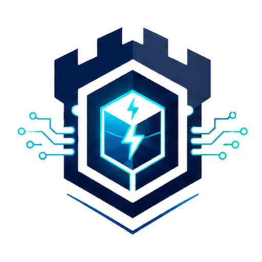

<div align="center">



# DriveFort AI V3

### Secure Intelligence for Electric Mobility

[](https://github.com/sarahalqaisi/DriveFort-AI/actions/workflows/ci.yml)
[](https://github.com/sarahalqaisi/DriveFort-AI/releases/latest)
[](https://www.python.org/)
[](https://flask.palletsprojects.com/)
[](tests/)

**AI-powered EV cybersecurity and digital-twin platform for threat detection, protection, recovery, and forensic analysis.**

[Latest Release](https://github.com/sarahalqaisi/DriveFort-AI/releases/latest) ·
[Features](#what-is-new-in-v3) ·
[Installation](#runtime-tracks) ·
[Validation](#validation)

</div>

---

DriveFort AI is an academic cyber-physical security platform for connected electric vehicles. V3 adds a modular innovation layer above the stabilized CARLA/simulation core, providing explainable threat fusion, digital-twin prediction, attack replay, automated recovery, fleet intelligence, and secure update validation in one dashboard.

> DriveFort AI is a controlled research and graduation-project platform. It is not certified for public-road use or direct deployment as a production automotive safety controller.

## What is new in V3

V3 implements all 23 proposed capabilities:

1. DriveFort Time Machine
2. Ghost Digital Twin
3. Protected vs Unprotected Replay
4. ECU Integrity Map
5. Smart Safety Envelope
6. AI Decision Explainer
7. DriveFort Copilot
8. Threat Confidence Fusion
9. Attack Chain Builder
10. Adaptive Attacker
11. Stealth Attack Mode
12. Virtual Backup ECU
13. Automatic Recovery Playbooks
14. Incident Storyboard
15. Evidence Integrity Verification
16. Executive, Technical, and Forensic Reports
17. Automatic Attack Graph
18. Mission Control Mode
19. Scenario Director
20. Live Performance Score
21. Fleet Command Center
22. Vehicle-to-Vehicle Threat Sharing
23. OTA Security Center

The V3 layer is implemented under `src/v3/` and does not add new monkey patches to the legacy simulation engine.

## Dashboard

The dashboard now includes a dedicated **V3 Innovation Lab** tab with:

- Actual-versus-expected digital-twin paths.
- Dynamic safety-envelope limits.
- Threat-fusion scores and explainable evidence.
- ECU trust and virtual backup status.
- Counterfactual protection benchmarking.
- Attack-chain and stealth/adaptive attacker controls.
- Automated recovery playbooks and incident storyboard.
- Guided committee scenarios and Mission Control view.
- Fleet status, V2V sharing, and OTA package verification.
- PDF and JSON report exports.
- Local Chart.js, Leaflet, fonts, and icons for an internet-independent presentation.

## Runtime tracks

### Modern development and Docker

Python 3.8 or newer installs Flask 3.x automatically.

```bash
python -m venv .venv
source .venv/bin/activate       # Linux/macOS
# .venv\Scripts\activate      # Windows
pip install -r requirements-dev.txt
python app.py
```

Open `http://127.0.0.1:5000`.

### Legacy CARLA 0.9.13

CARLA 0.9.13 often uses a Python 3.7 wheel. The conditional requirements retain the compatible Flask 2.2 dependency track for Python 3.7.

1. Start CARLA manually.
2. Start DriveFort AI with the Python interpreter that can import the CARLA wheel.
3. Select **Connect CARLA**.
4. Select **Spawn Vehicle**.
5. Start normal driving and train the baseline.
6. Open **V3 Innovation Lab** or run one of the existing adopted attack scenarios.

Offline analytical testing can be enabled with:

```bash
DRIVEFORT_ALLOW_MOCK=1
```

Do not enable mock mode when presenting claims about physical CARLA vehicle behavior.

## Main architecture

```text
app.py                         Flask application and legacy-compatible APIs
src/v3/advanced_features.py    V3 feature orchestration and derived safety models
src/v3/api.py                  Explicit V3 API blueprint and report exports
src/core/brand.py              Central DriveFort identity contract
src/core/state_machine.py      Operator-facing lifecycle derivation
src/simulation_engine.py       Existing simulation/CARLA orchestration core
src/carla_bridge.py            CARLA actor, telemetry, and control adapter
src/incident_store.py          SQLite forensic ledger with SHA-256 hash chaining
static/js/app.js               Dashboard rendering and V3 interaction controls
static/css/style.css           Dashboard and V3 Innovation Lab styling
templates/index.html           Main dashboard
tests/                         Regression, API, feature, and UI-contract tests
```

## V3 API

The main V3 routes are under `/api/v3`:

```text
GET  /api/v3/overview
GET  /api/v3/features
GET  /api/v3/time-machine
GET  /api/v3/ghost-twin
POST /api/v3/benchmark/run
GET  /api/v3/ecu-integrity
GET  /api/v3/safety-envelope
GET  /api/v3/ai/explain
POST /api/v3/copilot/query
GET  /api/v3/threat-fusion
POST /api/v3/attack-chain/configure
POST /api/v3/attack-chain/advance
POST /api/v3/adaptive-attacker/run
POST /api/v3/stealth/start
POST /api/v3/virtual-ecu/activate
POST /api/v3/recovery/playbook/prepare
POST /api/v3/recovery/playbook/advance
GET  /api/v3/incident/storyboard
GET  /api/v3/evidence/verify
GET  /api/v3/report/<level>
GET  /api/v3/report/<level>/pdf
GET  /api/v3/attack-graph
GET  /api/v3/mission-control
GET  /api/v3/scenarios
POST /api/v3/scenario/start
POST /api/v3/scenario/advance
GET  /api/v3/performance-score
GET  /api/v3/fleet
POST /api/v3/v2v/share
POST /api/v3/ota/verify
```

Report levels are `executive`, `technical`, and `forensic`.

## Environment configuration

Copy `.env.example` values into your shell or launcher.

```text
DRIVEFORT_HOST
DRIVEFORT_PORT
DRIVEFORT_DEBUG
DRIVEFORT_ALLOW_MOCK
DRIVEFORT_COMMAND_SECRET
DRIVEFORT_OTA_SECRET
DRIVEFORT_INCIDENT_DB
CARLA_EXE_PATH
```

Use long random secrets outside local demonstrations.

## Validation

Run the automated suite:

```bash
pytest -q
```

Run the standalone V3 API verifier:

```bash
DRIVEFORT_ALLOW_MOCK=1 python verify_drivefort_v3.py
```

Current result for the packaged version:

- **43 automated tests passed.**
- **33 offline API checks passed.**
- Python compilation passed.
- JavaScript syntax validation passed.
- 23/23 proposed V3 capabilities are represented in backend APIs and the dashboard.
- Existing console verification passed for 27 controls and 19 legacy backend routes.

Automated tests cannot prove live CARLA physics without a running simulator. Follow `docs/VALIDATION_V3.md` before making simulator-specific claims.

## Publishing to GitHub

This repository includes a safe `.gitignore`, automated GitHub Actions tests, security guidance, and publishing scripts for Windows and Unix-like systems. See [`GITHUB_UPLOAD.md`](GITHUB_UPLOAD.md).

Runtime databases and local `.env` files are intentionally excluded from version control.
