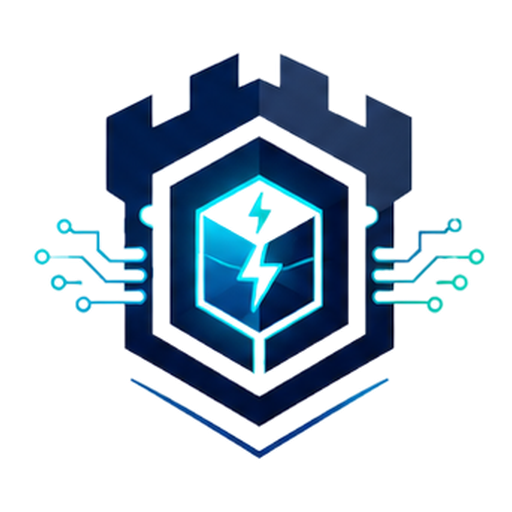
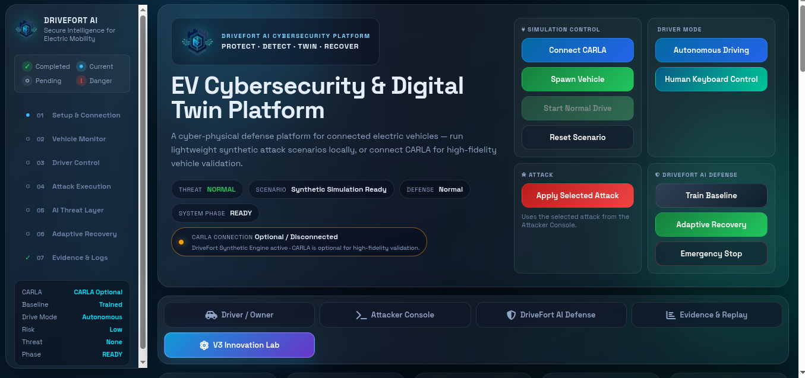
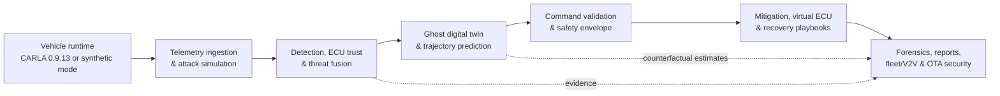

<p align="center">
  
</p>

# DriveFort AI

**Cybersecurity and resilient defense platform for connected and electric vehicles.**

[](https://github.com/sarahalqaisi/DriveFort-AI/actions/workflows/ci.yml)
[](#validation)
[](#complete-v3-capability-matrix)
[](LICENSE)

<p align="center">
  
</p>

## Why this matters

Connected vehicles combine safety-critical controls, networked ECUs, sensors,
software updates, and cloud or fleet communication. DriveFort AI demonstrates
how those layers can be monitored and defended as one cyber-physical system:
detect an attack, explain the evidence, predict unsafe behavior, constrain
commands, recover trusted control, and preserve incident evidence.

- **23/23 V3 security capabilities implemented** across backend APIs and the dashboard.
- **69 automated tests passing** on the current repository state.
- **33/33 offline API verification checks passing** in the synthetic runtime.

> Benchmark values produced by the offline benchmark endpoint are **synthetic
> analytical estimates**, not measured CARLA telemetry or real-world safety
> evidence. See [Benchmark methodology](docs/BENCHMARK_METHODOLOGY.md).

DriveFort AI is a controlled research and graduation-project platform. It is
not certified for public-road use or deployment as a production automotive
safety controller.

## System architecture


```mermaid
flowchart LR
    Runtime["Vehicle runtime<br/>CARLA 0.9.13 or synthetic mode"]
    Telemetry["Telemetry ingestion<br/>& attack simulation"]
    Detection["Detection, ECU trust<br/>& threat fusion"]
    Twin["Ghost digital twin<br/>& trajectory prediction"]
    Safety["Command validation<br/>& safety envelope"]
    Recovery["Mitigation, virtual ECU<br/>& recovery playbooks"]
    Outcomes["Forensics, reports,<br/>fleet/V2V & OTA security"]

    Runtime --> Telemetry
    Telemetry --> Detection
    Detection --> Twin
    Twin --> Safety
    Safety --> Recovery
    Recovery --> Outcomes

    Detection -. evidence .-> Outcomes
    Twin -. counterfactual estimates .-> Outcomes
```

The legacy-compatible simulation engine and CARLA bridge provide runtime state.
`DriveFortV3Features` remains the orchestration facade, while dedicated V3
services handle threat fusion, benchmarking, recovery, fleet intelligence, OTA
verification, and reporting. The facade does not monkey-patch the engine.

## Demo in 60 seconds

1. Start the application in the offline synthetic runtime:

   ```bash
   DRIVEFORT_ALLOW_MOCK=1 DRIVEFORT_RUNTIME_MODE=synthetic python app.py
   ```

2. Open `http://127.0.0.1:5000`, then select a supported attack scenario.
3. Watch **Threat Fusion**, the **ECU Integrity Map**, and the **Ghost Digital
   Twin** explain the emerging risk and predicted trajectory deviation.
4. Activate protection or advance a **Recovery Playbook** to observe command
   constraints, virtual ECU fallback, and lifecycle recovery.
5. Run **Protected vs Unprotected Replay**, then inspect an executive,
   technical, or forensic report.

This flow demonstrates application behavior and analytical models. It does not
claim physical validation. For simulator evidence, repeat the scenario with the
supported CARLA runtime and the validation checklist.

## Capabilities by defense layer

### Detection & threat intelligence

Threat Confidence Fusion, ECU Integrity Map, AI Decision Explainer, DriveFort
Copilot, Attack Graph, Time Machine, and Live Performance Score combine
behavioral, command, trust, and trajectory evidence.

### Digital twin & safety

Ghost Digital Twin and Smart Safety Envelope compare actual and expected
behavior, predict unsafe deviation, and define constraints for vehicle commands.

### Attack simulation

Protected vs Unprotected Replay, Attack Chain Builder, Adaptive Attacker,
Stealth Attack Mode, Scenario Director, and Mission Control support repeatable
security demonstrations across synthetic and CARLA-compatible runtime paths.

### Automated recovery

Virtual Backup ECU and Automatic Recovery Playbooks demonstrate containment,
trusted fallback control, stabilization, and subsystem restoration.

### Forensics & reporting

Incident Storyboard, Evidence Integrity Verification, and executive, technical,
and forensic reports preserve and communicate incident context.

### Fleet & V2V security

Fleet Command Center and Vehicle-to-Vehicle Threat Sharing propagate security
advisories and policy state across the demonstration fleet.

### OTA security

OTA Security Center validates package hashes, HMAC signatures, compatible
versions, secret configuration, and guarded demonstration-signing behavior.

## Benchmark integrity

`POST /api/v3/benchmark/run` currently creates deterministic **synthetic
counterfactual estimates**. Each completed result identifies:

- its source and whether it was measured;
- analytical model version, deterministic scenario ID, and scenario seed;
- generation time and normalized benchmark evidence;
- protected and unprotected metric categories, including detection latency,
  maximum deviation, stabilization time, trust loss, and outcome.

The existing response fields remain available for compatibility. Synthetic
collision probability, deviation, latency, and recovery values must not be
presented as measured simulator results. A result may be labeled
`source: carla` and `measured: true` only when it comes from an instrumented
CARLA run.

Formulas, assumptions, rounding, reproducibility, CARLA evidence requirements,
and limitations are documented in
[docs/BENCHMARK_METHODOLOGY.md](docs/BENCHMARK_METHODOLOGY.md).

## Runtime tracks

### Modern development and Docker

The modern track supports Python 3.8 or newer. CI currently exercises Python
3.10 and 3.12.

```bash
python -m venv .venv
source .venv/bin/activate       # Linux/macOS
# .venv\Scripts\activate      # Windows
pip install -r requirements-dev.txt
python app.py
```

Open `http://127.0.0.1:5000`.

Docker users can start the packaged service with:

```bash
docker compose up --build
```

### Legacy CARLA 0.9.13

CARLA 0.9.13 commonly uses a Python 3.7 wheel. Conditional dependencies retain
a Flask 2.2-compatible track for that environment.

1. Start CARLA manually.
2. Start DriveFort AI with the interpreter that can import the CARLA wheel.
3. Select **Connect CARLA**, then **Spawn Vehicle**.
4. Start normal driving and train the baseline.
5. Open **V3 Innovation Lab** or run an adopted attack scenario.
6. Follow [docs/VALIDATION_V3.md](docs/VALIDATION_V3.md) before describing any
   output as measured simulator behavior.

Do not enable mock mode when presenting claims about physical CARLA behavior.

## Key implementation areas

| Path | Responsibility |
|---|---|
| `app.py` | Flask application and legacy-compatible API integration |
| `src/simulation_engine.py` | Synthetic/CARLA runtime orchestration |
| `src/carla_bridge.py` | CARLA actor, telemetry, and control adapter |
| `src/v3/advanced_features.py` | Backward-compatible V3 orchestration facade |
| `src/v3/services.py` | Threat, benchmark, recovery, fleet, OTA, and reporting services |
| `src/v3/benchmark.py` | Benchmark provenance and bounded evidence model |
| `src/v3/api.py` | V3 Flask blueprint and endpoint contracts |
| `src/v3/validation.py` | V3 request validation and consistent HTTP 400 errors |
| `src/v3/reporting.py` | Dependency-free report PDF rendering |
| `src/incident_store.py` | SQLite forensic ledger with SHA-256 hash chaining |
| `templates/index.html` | Main dashboard |
| `static/js/app.js` | Dashboard state rendering and controls |
| `tests/` | Regression, API, security, feature, and UI-contract tests |

## Complete V3 capability matrix

The grouped presentation above is the recommended project overview. This matrix
retains the complete implementation inventory for technical review.

| # | Capability | Defense area |
|---:|---|---|
| 1 | DriveFort Time Machine | Forensics & reporting |
| 2 | Ghost Digital Twin | Digital twin & safety |
| 3 | Protected vs Unprotected Replay | Attack simulation |
| 4 | ECU Integrity Map | Detection & threat intelligence |
| 5 | Smart Safety Envelope | Digital twin & safety |
| 6 | AI Decision Explainer | Detection & threat intelligence |
| 7 | DriveFort Copilot | Detection & threat intelligence |
| 8 | Threat Confidence Fusion | Detection & threat intelligence |
| 9 | Attack Chain Builder | Attack simulation |
| 10 | Adaptive Attacker | Attack simulation |
| 11 | Stealth Attack Mode | Attack simulation |
| 12 | Virtual Backup ECU | Automated recovery |
| 13 | Automatic Recovery Playbooks | Automated recovery |
| 14 | Incident Storyboard | Forensics & reporting |
| 15 | Evidence Integrity Verification | Forensics & reporting |
| 16 | Three-Level Incident Reports | Forensics & reporting |
| 17 | Automatic Attack Graph | Detection & threat intelligence |
| 18 | Mission Control Mode | Attack simulation |
| 19 | Scenario Director | Attack simulation |
| 20 | Live Performance Score | Detection & threat intelligence |
| 21 | Fleet Command Center | Fleet & V2V security |
| 22 | Vehicle-to-Vehicle Threat Sharing | Fleet & V2V security |
| 23 | OTA Security Center | OTA security |

## V3 API

All V3 endpoints use the `/api/v3` prefix. Representative routes:

| Purpose | Routes |
|---|---|
| System state | `GET /overview`, `GET /features`, `GET /mission-control` |
| Detection and safety | `GET /threat-fusion`, `GET /ecu-integrity`, `GET /ghost-twin`, `GET /safety-envelope` |
| Simulation | `POST /benchmark/run`, `POST /attack-chain/configure`, `POST /attack-chain/advance`, `POST /stealth/start` |
| Recovery | `POST /virtual-ecu/activate`, `POST /recovery/playbook/prepare`, `POST /recovery/playbook/advance` |
| Evidence and reports | `GET /time-machine`, `GET /evidence/verify`, `GET /report/<level>`, `GET /report/<level>/pdf` |
| Fleet and updates | `GET /fleet`, `POST /v2v/share`, `POST /ota/verify` |

Successful response contracts remain backward compatible. Invalid V3 POST
payloads return HTTP 400 with a consistent JSON error object. V3 security-state
responses explicitly disable caching.

## Environment configuration

Use [.env.example](.env.example) as the configuration reference. Important
settings include:

```text
DRIVEFORT_HOST
DRIVEFORT_PORT
DRIVEFORT_DEBUG
DRIVEFORT_ALLOW_MOCK
DRIVEFORT_RUNTIME_MODE
DRIVEFORT_COMMAND_SECRET
DRIVEFORT_OTA_SECRET
DRIVEFORT_OTA_DEMO_SIGNING
DRIVEFORT_INCIDENT_DB
CARLA_EXE_PATH
```

Use long random secrets outside isolated demonstrations. OTA verification
requires a secret of at least 32 bytes. See [SECURITY.md](SECURITY.md) for
reporting and operational security guidance.

## Validation

```bash
pytest -q
python verify_drivefort_v3.py
python -m compileall -q app.py src tests
```

Current repository results:

- **69 automated tests passed**
- **33/33 offline V3 API checks passed**
- **23/23 V3 capabilities represented**
- Python compilation passed
- GitHub Actions validates Python 3.10 and 3.12

Offline checks validate application contracts and synthetic analytical behavior.
They cannot prove CARLA physics or real-vehicle safety. Use
[docs/VALIDATION_V3.md](docs/VALIDATION_V3.md) for the simulator-specific
validation boundary.

## Project documentation

- [Benchmark methodology](docs/BENCHMARK_METHODOLOGY.md)
- [V3 validation guide](docs/VALIDATION_V3.md)
- [CARLA integration](docs/CARLA_FULL_INTEGRATION.md)
- [CARLA quick start](docs/carla_quickstart.md)
- [Security policy](SECURITY.md)
- [Contributing guide](CONTRIBUTING.md)
- [Third-party notices](THIRD_PARTY_NOTICES.md)
- [Changelog](CHANGELOG.md)
- [Migration from ZoneGuard](docs/MIGRATION_FROM_ZONEGUARD.md)

## License

Licensed under the [Apache License 2.0](LICENSE).
